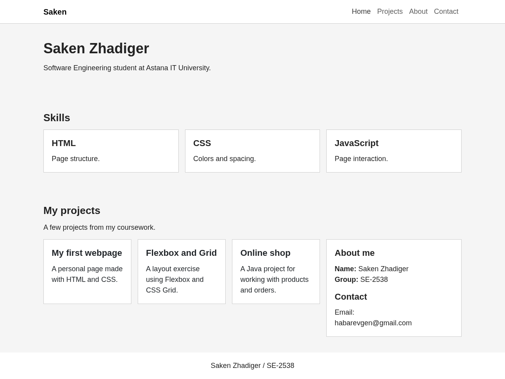
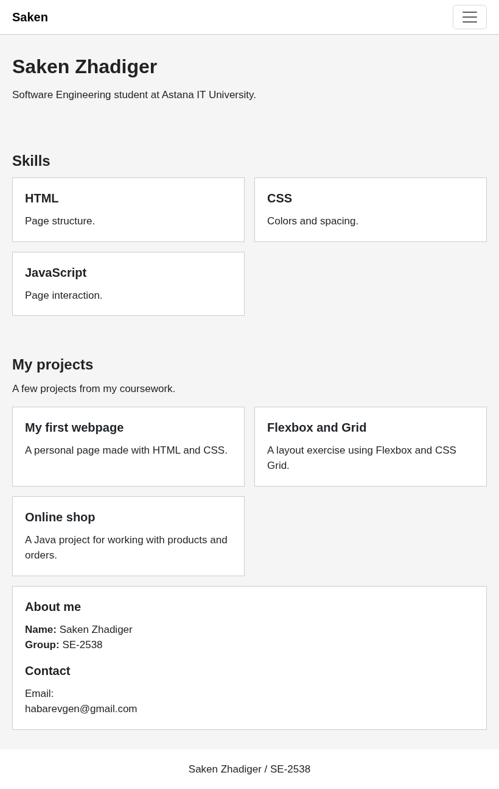
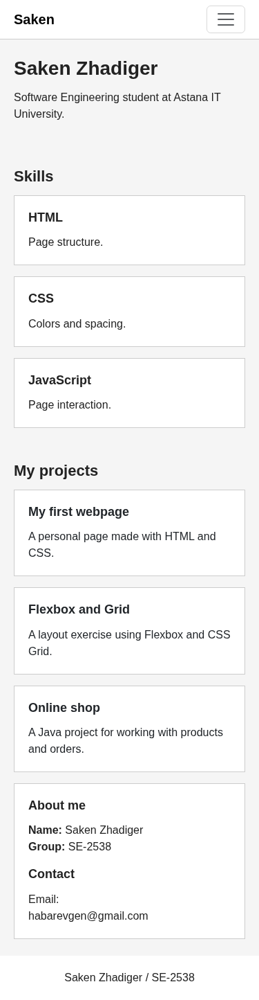
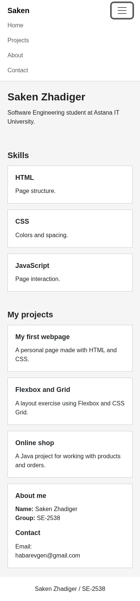

# Assignment 3: Responsive Web Design

**Name:** Saken Zhadiger  
**Group:** SE-2538

## Project Overview

This project is a simple responsive portfolio website made with HTML, CSS, Media Queries and Bootstrap 5.3.6. It includes a navigation bar, an introduction, three skill boxes, three project cards, personal information, contact details and a footer.

All tasks are combined in one page. The HTML is in `index.html`, and the custom styles are in `style.css`. The website uses Arial and does not include custom JavaScript.

## How to Run

Keep `index.html` and `style.css` in the same folder and open `index.html` in a browser. An internet connection is needed to load Bootstrap CSS and JavaScript from the CDN. No installation is required.

## Project Structure

```text
index.html
style.css
README.md
screenshots/
    desktop.png
    tablet.png
    mobile.png
    mobile-menu-open.png
```

## Part 1. Media Queries

### Task 0. Responsive Typography

Headings and paragraphs change size at different screen widths. The base CSS is used for mobile screens. Two media queries apply larger text sizes at `768px` and `992px`.

| Screen size | Viewport width | Main heading (`h1`) | Paragraph text |
| --- | --- | --- | --- |
| Mobile | Below 768px | 28px | 16px |
| Tablet | 768px to below 992px | 32px | 17px |
| Desktop | 992px and above | 36px | 18px |

The sizes of `h2` and `h3` also change. Paragraphs inherit their font size from `body`.

**Desktop:**



**Tablet:**



**Mobile:**



### Task 1. Responsive Layout with Media Queries

The Skills section contains three boxes: HTML, CSS and JavaScript. Their layout uses CSS Grid and custom media queries, not Bootstrap grid classes.

On mobile, the boxes are stacked vertically. On tablet, two boxes appear in the first row and the third box moves to the next row. On desktop, all three boxes appear in one row.

The `.media-boxes` class uses `grid-template-columns: 1fr` by default. This changes to `repeat(2, 1fr)` at `768px` and `repeat(3, 1fr)` at `992px`.

**Desktop:**


**Tablet:**


**Mobile:**


## Part 2. Bootstrap Grid System

### Task 2. Bootstrap Responsive Columns

The three project cards demonstrate Bootstrap's 12-column grid. Each card is placed inside a column with the following classes:

```html
<div class="col-12 col-md-6 col-lg-4">
```

On mobile, each column takes the full row. On tablet, each takes half of the row, so two cards appear first and the third moves below. On desktop, each takes four of the twelve columns, so all three cards appear side by side.

These columns belong to the nested `.row` inside the projects area. The same cards are also used in Task 4.

**Desktop:**


**Tablet:**


**Mobile:**


### Task 3. Bootstrap Navigation Bar

The header contains a Bootstrap navbar with the Saken logo on the left and Home, Projects, About and Contact links on the right.

The `navbar-expand-lg` class displays the expanded menu at `992px` and above. Below this width, a hamburger button replaces the expanded links. The button uses `data-bs-target="#menu"` to open and close the menu. Bootstrap's JavaScript bundle handles this interaction.

**Desktop navigation:**


**Mobile navigation after opening the menu:**



## Part 3. Combined Project

### Task 4. Responsive Portfolio Page

The portfolio combines custom Media Queries and Bootstrap Grid.

On desktop, the projects area is on the left with `col-lg-8`, and the sidebar is on the right with `col-lg-4`. The sidebar contains the name, group and email address. Below `992px`, the sidebar moves under the projects. A full-width footer appears after the main content.

Custom media queries change text sizes and section spacing. Section padding increases from `24px` on mobile to `32px` on tablet and `40px` on desktop. The `.portfolio-note` description is hidden on mobile and shown from `768px` upward.

**Desktop:**


**Tablet:**


**Mobile:**


## Work Process Summary

The page was organised into a header, main sections, sidebar and footer. Custom CSS was used for the basic appearance, typography and Skills layout. Bootstrap was used for the navigation bar and project grid. Media queries were added to adjust the page for different screen sizes.

The layout was checked at mobile, tablet and desktop widths. The screenshots show the page at 375px, 820px and 1280px, including the open mobile menu. The checks used a local copy of Bootstrap 5.3.6; the submitted HTML loads the same version through the CDN.
